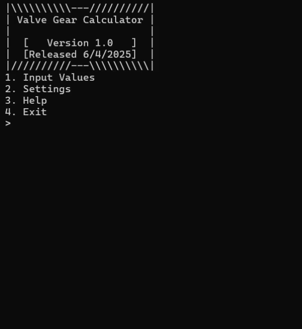

# Valve-Gear-Calculator
A friendly commission written to automate the tutorial found on the website https://thomasfan645.neocities.org/Valvegear.

# Features
- **Calculator**
  -
  - Calculate: After the user has input the necessary numbers, the program will go through 9 steps of calculations, getting a list of numbers needed for CAD software or physical measurements.
  - File Input: The user can choose to either input their numbers manually in the console, or input a file to automate the process (the file does need to be named "input.txt" to work).
  - File Output: After the calculations sucessfully finish, the user will gain access to save the results to "inputs/inputs.txt" and "outputs/outputs.txt."
      - The saved "inputs.txt" can be used as is or edited in future usage of the program to streamline the process.
- **Help**
  -
  - Input Values: This menu helps the user know what inputs they need, and how to get them.
  - Formatting Files: This menu helps the user know how to manually format their file, and where to place it for usage.
      - There is a known bug on this menu which will duplicate the top text, a fix will come in Version 1.1.
  - Program Info: This menu is simply extra information on the program + developer notes.

# Example of Program 
   

Copyright 2025 © Deaven S. Garcia
